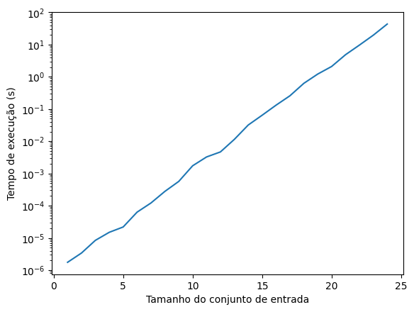
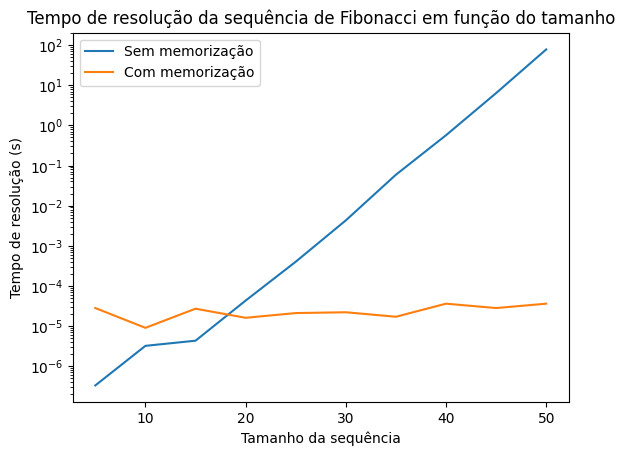

# SUPERCOMPUTAÇÃO, 2024-2

## Prova Intermediária - Resolução

Jerônimo de Abreu Afrange

### Questão 1

#### 1. "Implemente o algoritmo heurístico descrito acima em C++. (entregue o código)"

Implementação em `/questao_1/programa.cpp`

Estrutura arquivo de entrada:

    <QUANTIDADE_NÚMEROS>
    <SOMA_DESEJADA>
    <S_0>
    <S_1>
    <S_2>
    <S_3>
    ...
    <S_N>

Na etapa 2 da heurística descrita, o número em questão (s_i) é incluso na soma se o seu valor somado ao resto já incluso não ultrapassar o valor da soma desejada.

#### 2. "Faça cenários de teste e comprove a corretude da solução."

**Teste 1:** verdadeiro positivo em `questao_1/teste_1.txt`

**Teste 2:** falso negativo em `questao_1/teste_2.txt`

#### 3. "Discuta a eficácia da sua heurística. Em que cenários ela pode falhar em encontrar um subconjunto existente que some \( T \)? (entregue sua resposta justificada)"

A heurística implementada não consegue analisar tudo o que vem depois do número que ela está analisando no momento. Para a seguinte entrada, por exemplo

    5   <N>
    30  <T>
    29  <S_0>
    16  <S_1>
    14  <S_2>
    5   <S_3>
    2   <S_4>

o 29 já é incluso de cara na solução, só porque ele cabe. No entanto, o algoritmo não percebe que, se ele não incluir o 29, existe uma outra solução.

### Questão 2

#### 1. "Escreva o código da solução ótima em C++ (você pode usar recursão ou não);"

Implementação em `/questao_2/programa.cpp`

Formato da entrada igual ao da implementação da questão anterior.

#### 2. "Gere a solução para 10 entradas distintas em ordens de grandeza diferentes (algumas entradas pequenas, algumas médias, algumas grandes);"

Gráfico da relação entre o tempo de execução e o tamanho da entrada:



Se não estiver carregando, ver `/questao_2/tempos_execucao.png`

#### 3. "Compare o tempo de execução deste código nas 10 entradas. O comportamento está alinhado com o esperado? Justifique."

Considerando que o espaço de pesquisa do algoritmo exaustivo dobra a cada incremento do tamanho do conjunto de entrada, espera-se que a complexidade dele seja `O(n²)`. A partir do gráfico do item anterior, percebe-se que o comportamento está sim alinhado com o esperado.

### Questão 3

#### "Em sala de aula, nós implementamos diversas estratégias para a mochila binária. Explique a importância de buscar um balanço entre _exploration_ e _exploitation_. Dê um exemplo de como buscamos atingir _exploration_ e outro de como buscamos atingir _exploitation_ no Problema do Subconjunto de Soma. Elabore um pseudocódigo que combine tais estratégias e avalie criticamente sua efetividade."

Uma abordagem baseada em _exploitation_ é quando focamos em criar soluções para problemas com base no conhecimento atual sobre o problema em questão, priorizando a produção de uma solução imediata para o problema. Uma abordagem baseda em _exploration_, por outro lado, é quando tentamos encontrar novas maneiras de solucionar o problema, possivelmente sacrificando um pouco de tempo.

Um exemplo de técnica de _exploitation_ seria a implementação de um algoritmo guloso, que busca melhorar a solução com base em possíveis melhorias locais, de forma similar ao _local hill climb_ que foi abordado em aula. Um exemplo de técnica de _exploration_ seria a implementação de um algortimo genético, que usa aleatoriedade para otimizar a solução a partir de outras soluções.

A busca de um balanço entre as duas abordagens é importante porque é uma maneira de obter uma melhor relação custo benefício na hora de encontrar soluções, sendo o custo o tempo de execução e o benefício a qualidade da solução encontrada.

**Pseudocódigo que usa as duas abordagens**

    ordenar os números de forma decrescente
    soma = 0
    percorrer todos os números
        se o número desta iteração somado à soma atual não ultrapassar a soma desejada
            inclui o número
        se um número aleatório entre 0 e 100 for maior que 50
            remove o número que foi incluso agora da solução

A abordagem acima implementa uma heurística básica, que representa o _exploitation_ da abordagem, mas introduz uma perturbação aleatória, que representa o _exploration_ da abordagem. Isso permite que o algortimo siga um caminho geral mas tenha um pouco de aleatoriedade, que faz com que ele, possivelmente, encontre melhores soluções.

### Questão 4

Resolução em `/questao_4/resolucao.ipynb`

### Questão 5

Código fonte com memorização em `/questao_5/programa_otimizado.cpp`

Gráfico da relação entre o tempo de execução e o tamanho da entrada:



Se não estiver carregando, ver `/questao_5/tempos_execucao.png`

Como evidenciado pelo gráfico, a complexidade da solução vai de exponencial para constante com a implementação da memorização.

### Questão 6

#### 1. "Qual é a importância de aliar estratégias de implementação (Software) com recursos computacionais disponíveis (Hardware) para melhor endereçamento do problema?"

Ambos o _software_ e o _hardware_ envolvidos na resolução de um problema têm grande influência sobre o quão custosa é a resolução, em termos de tempo. A implementação do _software_ pode reduzir a complexidade do problema ao máximo possível e também fazer com que a resolução do problema possa ser executada em paralelo, reduzindo o tempo de execução. O _hardware_, por sua vez, é o que determina quantos fluxos de execução paralelas podem acontecer, assim como a velocidade de cada fluxo de execução. As duas coisas, portanto, quando devidamente conciliadas, podem reduzir o tempo de execução resolução de problemas.

#### 2. "Defina o que é Slurm e sua importância na programação paralela em larga escala."

O _Slurm_ é um _software_ utilizado em ambientes de computação distribuida que é responsável por administrar a execução de tarefas individuais. Os usuários o sistema submetem solicitações de execução ao _Slurm_ e ele aloca os recursos de _hardware_ necessários para cada tarefa, de forma ordenada. Sem o _Slurm_ não haveria organização na execução de diferentes tarefas, dificultando muito ou até mesmo impossibilitando a execução de mais de uma ao mesmo tempo, o que faz com que parte do _hardware_ fique ocioso mesmo quando há demanda.

#### 3. "Considerando o job configurado pelo ".slurm" abaixo, descreva quais recursos computacionais estão sendo solicitados ao Cluster, as limitações e condições de execução."

```
#!/bin/bash
#SBATCH --job-name=job_paralelo
#SBATCH --nodes=4
#SBATCH --ntasks-per-node=8
#SBATCH --time=02:00:00
#SBATCH --partition=compute
#SBATCH --output=resultado.out
#SBATCH --error=erro.err

# Carregar módulos necessários
module load mpi

# Executar o programa paralelo
mpirun -np 32 ./meu_programa_paralelo
```

A linha `#SBATCH --job-name=job_paralelo` define que a tarefa em questão se chama `job_paralelo`, e é assim que ela será chamada dentro do sistema.

A linha `#SBATCH --nodes=4` define que a tarefa necessita de quatro _nodes_ (máquinas) para ser executada.

A linha `#SBATCH --ntasks-per-node=8` define que cada em cada _node_ o programa precisa utilizar quatro _threads_.

A linha `#SBATCH --time=02:00:00` define que a tarefa vai durar no máximo duas horas. Se a tarefa exceder esse limite, ela é interrompida.

A linha `#SBATCH --partition=compute` define que a tarefa deve ser tratada a partir do conjunto de configurações da partição `compute`. Uma partição do _Slurm_ é um grupo ao qual tarefas podem pertencer que vão ser executadas de acordo com os limites e regras daquela partição.

A linha `#SBATCH --output=resultado.out` define que a saída padrão do programa será direcionada a um arquivo chamado `resultado.out`.

A linha `#SBATCH --error=erro.err` define que a saída de erros do programa será direcionada a um arquivo chamado `erro.err`.

As linhas seguintes definem qual é o executável a ser utilizado assim como os módulos necessários. Neste caso, na linha de execução, também é definido quantas _threads_ devem ser utilizadas (32, que serão distribuidas entre 4 máquinas com 8 threads cada).
